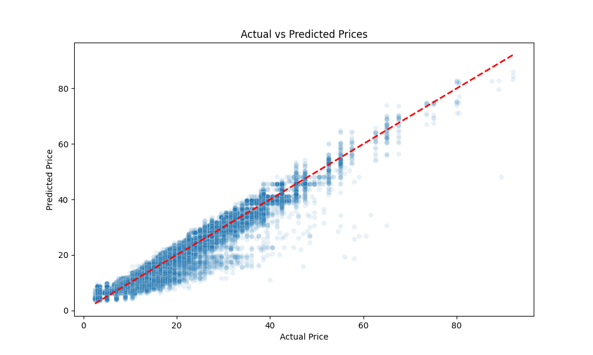

# 🚗 Dynamic Pricing Model for Ride-Sharing

## 📌 Project Overview
This project implements a Machine Learning model to predict ride-sharing prices (e.g., Uber/Lyft) based on dynamic factors. It simulates a real-world pricing engine that adjusts costs based on demand (surge), distance, and vehicle type.

**Goal:** accurate price estimation to optimize revenue and balance supply/demand.

## 📂 Dataset
- **Source:** Uber & Lyft Cab Data (Boston).
- **Features Used:**
  - `distance`: Distance of the ride (miles).
  - `surge_multiplier`: Demand-based price multiplier.
  - `cab_type`: Uber vs. Lyft.
  - `name`: Service class (e.g., UberXL, Lux).
  - `hour`: Time of day (derived from timestamp).
  - `source` & `destination`: Pickup and drop-off locations.

## 🛠️ Tech Stack
- **Language:** Python 3.10+
- **Libraries:** Pandas, Scikit-Learn, XGBoost, Seaborn, Matplotlib
- **Tools:** VS Code, Jupyter Notebooks

## 📊 Model Performance
The model was trained using **XGBoost Regressor** and achieved high accuracy on the test set.

| Metric | Value | Description |
| :--- | :--- | :--- |
| **R² Score** | **0.96** | Explains 96% of price variance. |
| **MAE** | **$1.52** | Avg error is roughly $1.50 per ride. |
| **MAPE** | **~8.5%** | Predictions are within 8.5% of actual price. |

### Performance Visualization
*Actual vs. Predicted Prices (Ideal = Red Line)*


## 🚀 How to Run Locally

### 1. Clone the Repository
```bash
git clone [https://github.com/YOUR_USERNAME/dynamic-pricing-project.git](https://github.com/YOUR_USERNAME/dynamic-pricing-project.git)
cd dynamic-pricing-project